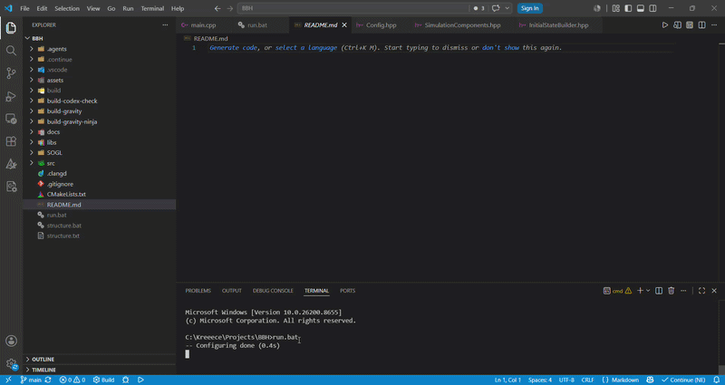

# 🌌 Black Hole Simulation

<p align="center">



</p>

<p align="center">
A real-time <b>2D Black Hole & Orbital Mechanics Simulation</b> built using <b>Modern C++20</b> and <b>OpenGL</b>.
</p>

<p align="center">


</p>

---

## 🎥 Demo

The original recording can be viewed here:

📹 **[Watch Full Demo](docs/demo/Screen%20Recording%202026-07-08%20173801.mp4)**

---

# 📖 Overview

This project is a real-time physics simulation of a black hole interacting with surrounding celestial bodies through Newtonian gravity.

The simulation demonstrates stable orbital mechanics, gravitational attraction, and fixed timestep physics while rendering everything using Modern OpenGL and GLSL shaders.

The project was built primarily as a graphics programming and physics-engine learning project while also serving as the foundation for a lightweight rendering framework (**SOGL**).

---

# ✨ Features

- 🌌 Newtonian Gravity Simulation
- ⚫ Massive Black Hole Object
- 🪐 Stable Planetary Orbits
- 🔄 Fixed Timestep Physics
- 🎯 Euler Integration
- 🚀 Modern OpenGL Rendering
- 🎨 GLSL Shader Pipeline
- 🧩 Modular Engine Architecture
- 📦 Custom SOGL Rendering Framework
- ⚡ Real-time Simulation
- 🔵 Procedurally Generated Circle Meshes
- 🖥 Cross-platform build using CMake

---

# 🧠 Physics

The simulation uses Newton's Universal Law of Gravitation.

### Gravitational Force

\[
F = G\frac{m_1m_2}{r^2}
\]

### Acceleration

\[
a = \frac{F}{m}
\]

### Velocity Update

\[
v = v + a\Delta t
\]

### Position Update

\[
x = x + v\Delta t
\]

The physics engine runs using a **fixed timestep** to ensure deterministic and stable orbital motion independent of rendering frame rate.

---

# 🏗 Project Structure

```
BlackHoleSimulation
│
├── assets/
│   ├── models/
│   ├── shaders/
│   └── textures/
│
├── docs/
│   ├── demo.gif
│   ├── demo.mp4
│
├── libs/
│   ├── glad/
│   ├── glfw/
│   └── glm/
│
├── SOGL/
│   ├── graphic/
│   ├── shaders/
│   └── window/
│
├── src/
│   ├── core/
│   ├── rendering/
│   ├── simulation/
│   └── main.cpp
│
├── CMakeLists.txt
└── README.md
```

---

# 🛠 Technologies Used

| Technology | Purpose |
|------------|---------|
| C++20 | Programming Language |
| OpenGL 4.6 | Graphics API |
| GLFW | Window & Input |
| GLAD | OpenGL Loader |
| GLM | Mathematics |
| GLSL | Shader Programming |
| CMake | Build System |

---

# ⚙ Requirements

- C++20 compatible compiler
- CMake 3.20+
- OpenGL 4.6 capable GPU
- Git

### Windows

- MinGW-w64 **or**
- Visual Studio 2022

---

# 🚀 Getting Started

## 1. Clone the Repository

```bash
git clone https://github.com/KrishMaheshwariDev/Black-Hole-Simulation

cd Black-Hole-Simulation
```

---

## 2. Configure Project

```bash
cmake -B build
```

---

## 3. Build

```bash
cmake --build build
```

---

## 4. Run

### Windows

```bash
./build/BlackHoleSim.exe
```

or

```bash
cd build

BlackHoleSim.exe
```

---

# 🎮 Controls

| Key | Action |
|------|--------|
| ESC | Exit Simulation |
| NumPad - | Zoom out |
| NumPad + | Zoom in |

---

# 🧩 SOGL Framework

This project also includes **SOGL**, a lightweight OpenGL rendering framework created during development.

It provides abstractions over:

- Window Creation
- Vertex Arrays
- Vertex Buffers
- Mesh Rendering
- Shader Management
- Renderer Utilities

SOGL is intentionally lightweight and educational, designed for graphics experiments rather than production use.

---

# 📚 What I Learned

This project provided hands-on experience with:

- Modern OpenGL
- Graphics Pipeline
- GLSL Programming
- Mesh Generation
- Orbital Mechanics
- Newtonian Gravity
- Numerical Integration
- Fixed Timestep Game Loops
- CMake Project Organization
- Engine Architecture

---

# 🚧 Future Improvements

- Multiple Black Holes
- N-Body Simulation
- Camera Controls
- Zoom & Pan
- ImGui Controls
- Collision Detection
- Accretion Disk
- Particle Effects
- Relativistic Physics
- Barnes-Hut Optimization
- Save / Load Simulation

---

# 🤝 Contributing

Contributions, suggestions, and bug reports are welcome.

If you'd like to improve the project:

1. Fork the repository.
2. Create a new branch.
3. Commit your changes.
4. Open a Pull Request.

---

# 📄 License

This project is licensed under the **MIT License**.

Feel free to use the code for learning, experimentation, or personal projects.

---

# 👨‍💻 Author

### Krish Maheshwari

B.Tech Computer Science (Data Science)

GitHub:

```
https://github.com/KrishMaheshwariDev
```

LinkedIn:

```
https://www.linkedin.com/in/krish-maheshwari
```

---

<p align="center">

### ⭐ If you found this project interesting, consider giving it a star!

It helps others discover the project and motivates future development.

</p>